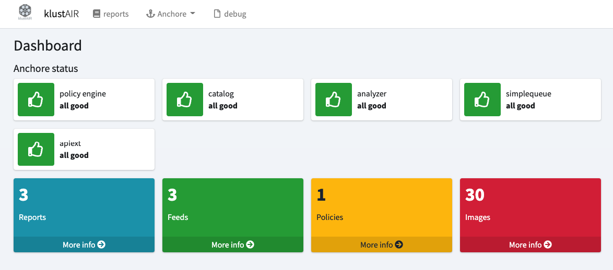
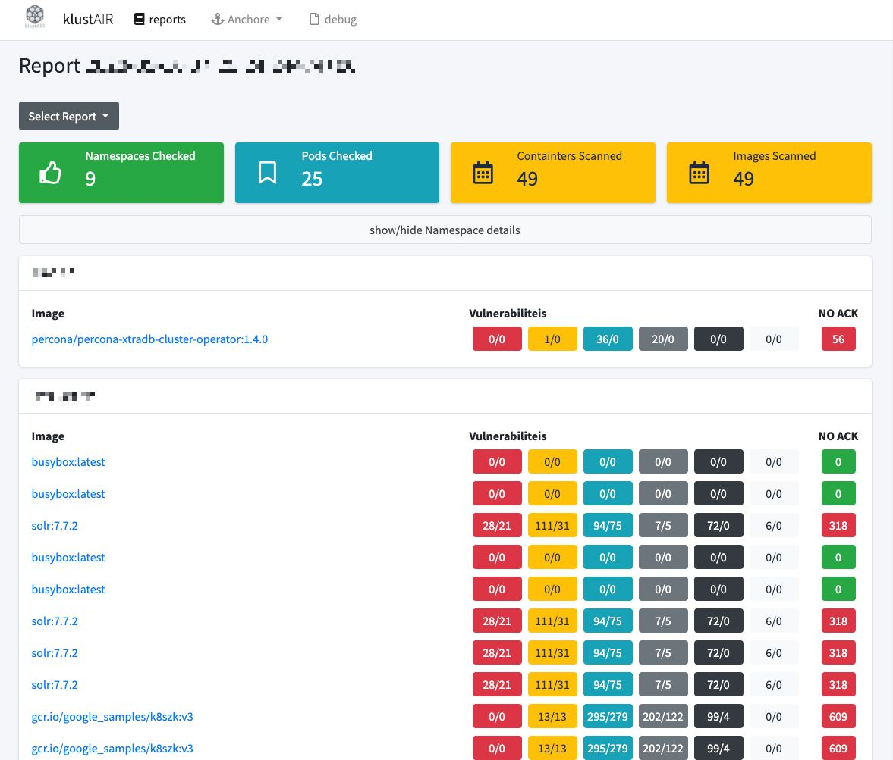
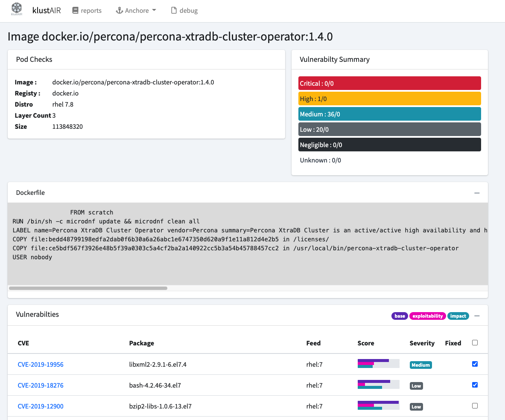
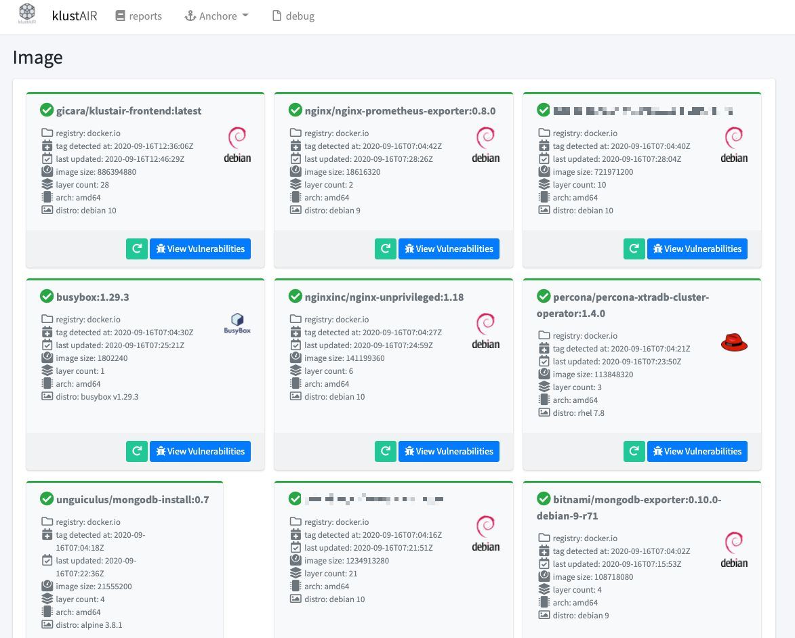
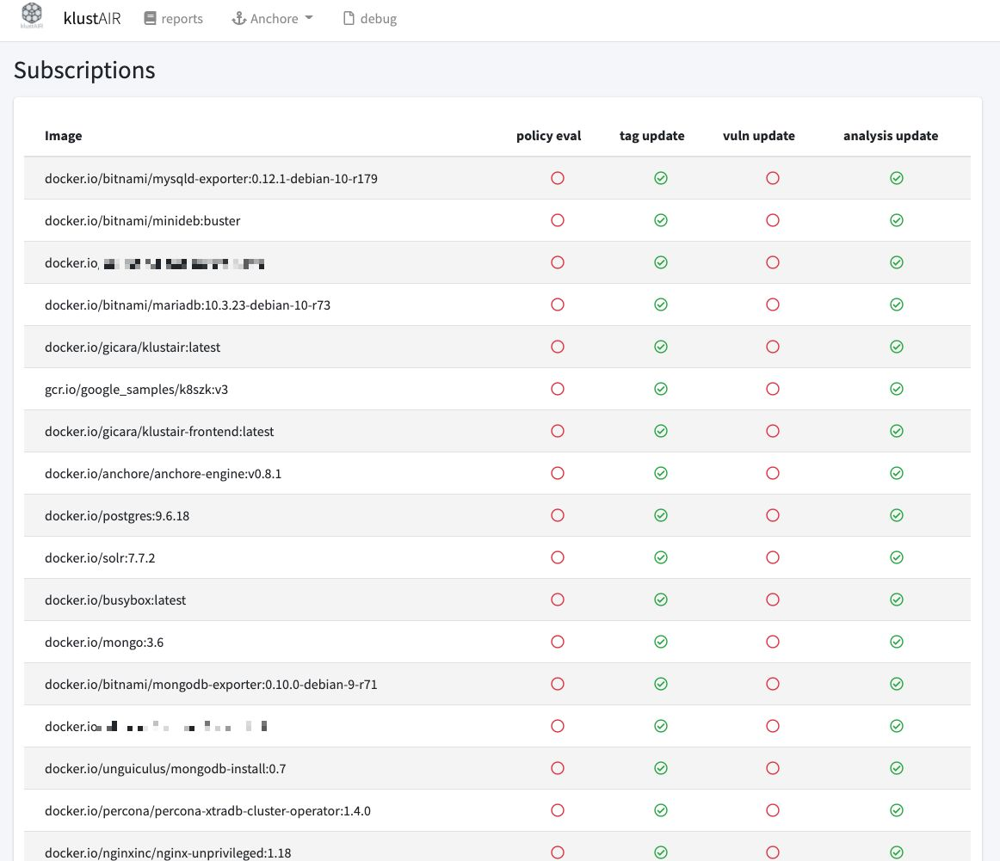

# KlustAIR Frontend
The Klustair scanner scanns your Kubernetes namespaces for the used images and submits them to Anchore. This frontend displays the result of the scanned namespaces and images in a report. 

### Main Features: 
- The vulnerabilities of an images can be reviewed and whitelisted if they dont apply to any risk.
- The Anchore system can be viewed (Policies, Subcriptions, Images, Feeds, Registries ...)

### Related Projects: 
- <a href="https://github.com/mms-gianni/klustair">Klustair scanner</a> to submit all your used images to Anchore
- <a href="https://github.com/mms-gianni/klustair-helm">Klustair Helm charts</a> to spin up Anchore and Klustair

## Home Screen

## Report

## Pod Details

## Images

## Policies

## Subscriptions

