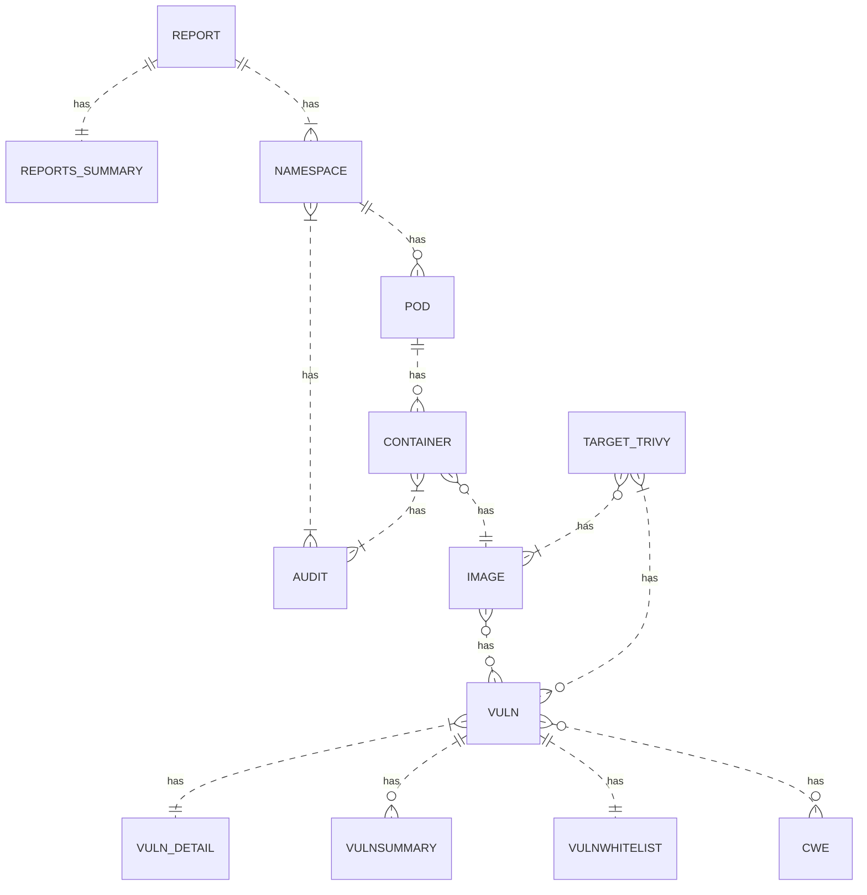
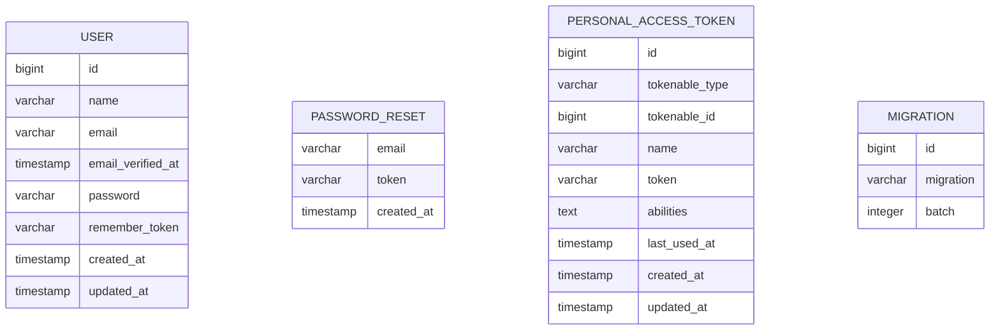

DB ER Digagram

```mermaid
erDiagram
    REPORT ||..|| REPORTS_SUMMARY : has
    REPORT ||..|{ NAMESPACE : has
    NAMESPACE }|..|{ AUDIT : has
    CONTAINER }|..|{ AUDIT : has
    NAMESPACE ||..o{ POD : has
    POD ||..o{ CONTAINER : has
    CONTAINER }o..|| IMAGE : has
    IMAGE }o..o{ VULN : has
    TARGET_TRIVY }|..o{ VULN : has
    TARGET_TRIVY }o..|{ IMAGE : has
    VULN }|..|| VULN_DETAIL : has
    VULN ||..o{ VULNSUMMARY : has
    VULN ||..|| VULNWHITELIST : has
    VULN }o..o{ CWE : has
```

```mermaid
erDiagram
    USER {
      bigint id 
      varchar name
      varchar email
      timestamp email_verified_at
      varchar password
      varchar remember_token
      timestamp created_at
      timestamp updated_at
    }
    PASSWORD_RESET {
      varchar email
      varchar token
      timestamp created_at
    }
    PERSONAL_ACCESS_TOKEN{
      bigint id
      varchar tokenable_type
      bigint tokenable_id
      varchar name
      varchar token
      text abilities
      timestamp last_used_at
      timestamp created_at
      timestamp updated_at
    }
    MIGRATION{
      bigint id
      varchar migration
      integer batch
    }
```